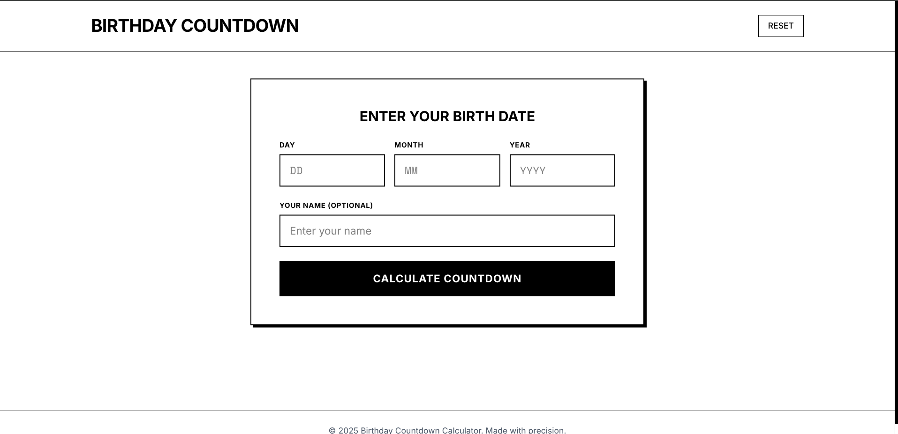
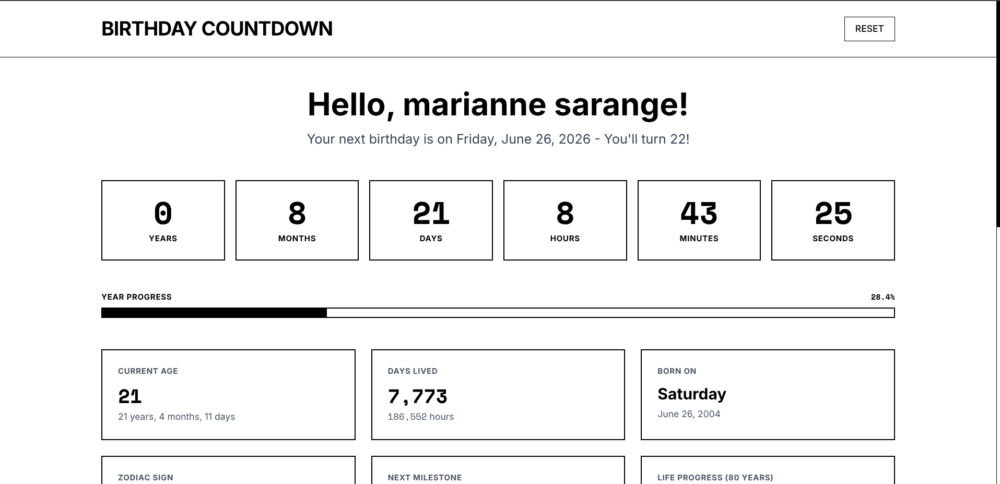
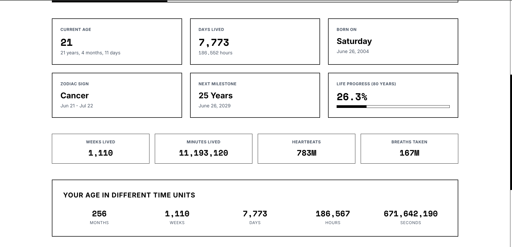

# Birthday Countdown Calculator

A modern, interactive birthday countdown calculator built with Laravel 12 and Tailwind CSS. Calculate your age, countdown to your next birthday, and discover fascinating life statistics!


## Features

- **Real-time Countdown Timer**: Live countdown to your next birthday with years, months, days, hours, minutes, and seconds
- **Comprehensive Age Statistics**: View your age in multiple time units (years, months, weeks, days, hours, seconds)
- **Life Progress Tracking**: Visual progress bars showing year progress and life progress (80-year lifespan)
- **Zodiac Sign Calculator**: Automatically determines your zodiac sign based on birth date
- **Life Milestones**: Shows your next age milestone (10, 13, 16, 18, 21, 25, 30, etc.)
- **Fascinating Statistics**: 
  - Days lived
  - Heartbeats (estimated)
  - Breaths taken (estimated)
  - Day of the week you were born
- **Responsive Design**: Works perfectly on desktop, tablet, and mobile devices
- **Modern UI**: Clean, minimalist black and white design with Tailwind CSS

## Screenshots

### Main Input Form

*Enter your birth date and optional name to start the countdown*

### Countdown Display

*Real-time countdown timer with personalized greeting and year progress*

### Detailed Statistics

*Comprehensive life statistics including age breakdown, zodiac sign, and milestone information*

## Technology Stack

### Backend
- **Laravel 12.0** - PHP web framework
- **PHP 8.2** - Server-side programming language
- **Composer** - Dependency management

### Frontend
- **Tailwind CSS 4.0** - Utility-first CSS framework
- **Vanilla JavaScript** - Client-side interactivity
- **Vite 7.0** - Build tool and development server

### Development Tools
- **PestPHP 4.1** - Testing framework
- **Laravel Pint** - Code style fixer
- **Laravel Pail** - Log viewer

## Quick Start

### Prerequisites
- PHP 8.2 or higher
- Composer
- Node.js 18 or higher
- npm

### Installation

1. **Clone the repository**
   ```bash
   git clone <repository-url>
   cd birthdaycalc
   ```

2. **Install PHP dependencies**
   ```bash
   composer install
   ```

3. **Install JavaScript dependencies**
   ```bash
   npm install
   ```

4. **Set up environment**
   ```bash
   cp .env.example .env
   php artisan key:generate
   ```

5. **Create database (SQLite)**
   ```bash
   touch database/database.sqlite
   php artisan migrate
   ```

6. **Build frontend assets**
   ```bash
   npm run build
   ```

7. **Start the development server**
   ```bash
   php artisan serve
   ```

8. **Open your browser**
   Navigate to `http://localhost:8000`

## Development

### Running in Development Mode
```bash
# Start all development services
composer dev

# Or run individually:
php artisan serve          # Laravel server
npm run dev               # Vite with hot reload
php artisan queue:listen  # Queue worker
php artisan pail          # Log viewer
```

### Testing
```bash
# Run all tests
php artisan test

# Or using composer
composer test
```

### Code Formatting
```bash
# Format PHP code
./vendor/bin/pint

# Build assets for production
npm run build
```

## How It Works

1. **Input Validation**: The form validates birth dates to ensure they're valid and not in the future
2. **Date Calculations**: JavaScript calculates various time differences using the Date object
3. **Real-time Updates**: A countdown timer updates every second using `setInterval`
4. **Statistics Generation**: Comprehensive life statistics are calculated including:
   - Current age in multiple formats
   - Days, hours, minutes lived
   - Estimated heartbeats and breaths
   - Zodiac sign determination
   - Next birthday and milestone dates
   - Progress through the current year and life

## Key Features Explained

### Countdown Timer
- Calculates time remaining until the next birthday
- Updates every second for real-time experience
- Handles edge cases like leap year birthdays

### Age Calculations
- Precise age calculation accounting for months and days
- Multiple time unit conversions (seconds to years)
- Handles timezone considerations

### Zodiac Signs
- 12 zodiac signs with accurate date ranges
- Handles signs that span calendar years (Capricorn)

### Life Statistics
- Estimated heartbeats based on average 70 BPM
- Estimated breaths based on average 15 per minute
- Life progress assuming 80-year lifespan

## Browser Support

- Chrome (latest)
- Firefox (latest)
- Safari (latest)
- Edge (latest)

## Contributing

1. Fork the repository
2. Create your feature branch (`git checkout -b feature/AmazingFeature`)
3. Commit your changes (`git commit -m 'Add some AmazingFeature'`)
4. Push to the branch (`git push origin feature/AmazingFeature`)
5. Open a Pull Request

## License

This project is open-sourced software licensed under the [MIT license](https://opensource.org/licenses/MIT).

## Acknowledgments

- Built with [Laravel](https://laravel.com) framework
- Styled with [Tailwind CSS](https://tailwindcss.com)
- Icons and inspiration from the Laravel community

---

**Made with precision** ✨

<p align="center"><a href="https://laravel.com" target="_blank"></a></p>